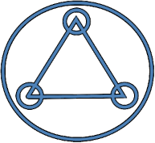

MIDOM
=====
Medical Image Deidentification Object Model

A set of concepts and relations to describe the process of DICOM deidentification. This
will hopefully make it easier to discuss and develop DICOM deidentification tools and
procedures.

Medical image deidentification refers to the process of removing personally identifiable
information (PII) from medical images. The goal is usually to enable secondary usage of this data
for scientific research. Deidentification is a requirement for scientific data use in
both the US (`HIPPAA <https://www.hipaajournal.com/de-identification-protected-health-information/>`_)
and EU (`GDPR <https://www.gdprsummary.com/anonymization-and-gdpr/>`_).

Task
----
The task of removing PII involves both technical and organizational elements. Technical
elements consists of both the actual processing of DICOM data as well as quantifying
and describing the efficacy and properties of a deidentification process. Organizational
elements include software provenance, Standard operating procedures, Security management,
incident management.

Approach
--------
The main difficulty MIDOM tries to address is vagueness and misunderstanding when talking
about the different *technical* aspects of deidentification. It does this by naming and
describing concepts and showing their relationships.

Non-goals
---------
What MIDOM is not.

No organizational elements
    MIDOM does not address any of the organizational elements involved in medical image
    deidentification. These are arguably *more* important than the technical elements,
    but nevertheless out of scope here. It is hoped that MIDOM will facilitate
    organizational choices by removing technical doubt.

No deidentification instructions
    MIDOM is about mapping out the structure and objects involved in deidentification,
    not about how to de de-indentification per-se. MIDOM has no opinion on how to
    clean data elements, pixel data or how to shift dates.

.. toctree::
    :maxdepth: 2
    :caption: Contents:

    objects
    components
    spaces
    comparison
    glossary
